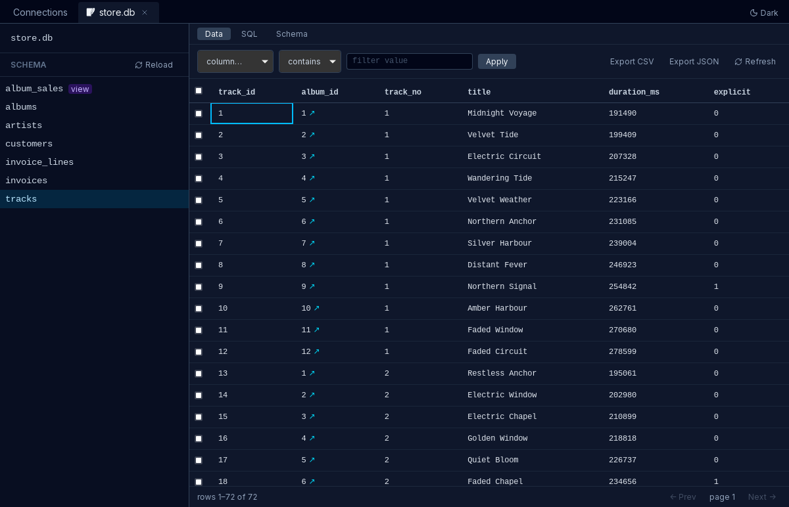

<p align="center">
  
</p>

<h1 align="center">Hubro</h1>

<p align="center">
  A fast desktop viewer for SQLite, Postgres, and SQL Server.
</p>

<p align="center">
  <a href="https://github.com/lokander/hubro/releases/latest"></a>
  <a href="https://github.com/lokander/hubro/actions/workflows/ci.yml"></a>
  <a href="LICENSE"></a>
  
</p>

Open a SQLite file or connect to a Postgres or SQL Server database, browse the
schema, run SQL, edit rows, and export the results — in one small native app
that starts fast and stays responsive on big tables. Passwords go to your
operating system's keyring rather than a config file, and remote servers can be
reached over an SSH tunnel or with Microsoft Entra ID sign-in.

Several other engines speak one of those three wire protocols, and hubro is
tested against them too — CockroachDB, YugabyteDB, TimescaleDB, Citus,
Materialize and RisingWave each have a row in
[Supported databases](#supported-databases), with the version tested and
whatever does not work.

Hubro runs on Linux, macOS, and Windows. It is free software (GPL-3.0).



## Install

Download the package for your platform from the
[latest release](https://github.com/lokander/hubro/releases/latest):

| Platform | Download |
| --- | --- |
| Linux | `.AppImage` (self-contained, most distributions) or `.deb` (Debian/Ubuntu; needs `libwebkit2gtk-4.1-0` and `libgtk-3-0`) |
| macOS | `.dmg` (Apple Silicon) |
| Windows | `.msi` or setup `.exe` (x64) |

<details>
<summary>macOS and Windows show a warning on first launch — here's why, and how to get past it</summary>

The builds are **unsigned** — there is no Apple Developer ID or Authenticode
certificate behind them yet — so both systems flag them as coming from an
unidentified developer.

On macOS, Gatekeeper blocks the first launch. Either clear the quarantine flag:

```bash
xattr -dr com.apple.quarantine /Applications/Hubro.app
```

…or, after the blocked launch, approve the app under System Settings → Privacy
& Security → **Open Anyway** (on macOS 14 and earlier, right-click → Open also
works). Either way it's only needed once.

On Windows, SmartScreen shows an "unknown publisher" warning for the
downloaded installer — click **More info → Run anyway**. The app also needs the
WebView2 runtime: Windows 11 and updated Windows 10 machines already have it,
and the installer downloads it during setup otherwise (internet access
required).

</details>

## Features

- **Connect** to SQLite files and Postgres or SQL Server servers (connection
  form or URL), with the OS keyring remembering passwords — Secret Service on
  Linux, Keychain on macOS, Credential Manager on Windows.
- **Browse** schemas — tables, views, and Postgres materialized views in the
  sidebar; columns, indexes, and foreign keys in the schema pane.
- **Data grid** with sorting, filtering, and paging that stays fast on huge
  tables and large values (windowed rendering, bounded memory).
- **SQL editor** — run queries and multi-statement scripts (wrapped in a
  transaction where the server has one), with schema-aware autocomplete, syntax
  highlighting, query history, cancellation, and a confirmation before writes.
- **Edit** rows inline — cell edits, inserts, and deletes staged and saved
  atomically, with primary-key/unique-index detection and confirmation before
  destructive operations. Views and materialized views are read-only, as is
  anything hubro cannot address one row of; see
  [Supported databases](#supported-databases) for which engines this applies
  to.
- **Export** query and table results to CSV or JSON (streamed).
- **Foreign-key navigation**, keyboard shortcuts (with a cheatsheet),
  dark/light theme, and window/session restore.
- **Secure remote access** — SSH tunnels (agent or key file) with host-key
  verification for Postgres and SQL Server, and Microsoft Entra ID sign-in for
  Azure Postgres and Azure SQL (interactive browser or managed identity).

## Supported databases

hubro has three backends — SQLite, Postgres, and SQL Server — but a backend is
really a *wire protocol*, and several engines speak one of them without being
that engine. Each is listed here only if hubro is tested against it end to end,
with the version that was actually run.

| Engine | Via backend | Verified version | Browse | Edit | Script | Notes |
| --- | --- | --- | --- | --- | --- | --- |
| SQLite | SQLite | 3.46.0 | Yes | Yes | Atomic | A table without a primary key stays editable through its `rowid`. |
| PostgreSQL | Postgres | 17.10 | Yes | Yes | Atomic | The reference implementation. A table with no primary key or unique index is read-only. |
| SQL Server | SQL Server | 2022 (16.0.4265.3) | Yes | Yes | Atomic | `GO` batches are split and run in order. |
| TimescaleDB | Postgres | 2.29.1 (on PostgreSQL 17.10) | Yes | Keyed hypertables | Atomic | Chunks and extension schemas are hidden as internal; `hypertable` and `continuous aggregate` show as badges. A hypertable with no key is read-only — see below. |
| Citus | Postgres | 14.1-1 (on PostgreSQL 18.4) | Yes | Yes | Atomic | Distributed and reference tables page, sort, filter, and edit through the distribution key. Changing a row's distribution column is refused by the server — Citus will not move a row between shards. Shards are hidden as internal. Needs `sslmode=disable` — see below. |
| CockroachDB | Postgres | v26.2.5 | Yes | Yes | Data only | A failing script does not undo its schema changes — **nor anything written before them**, because CockroachDB commits the open transaction before each `CREATE`/`ALTER`/`DROP`. hubro reports that rather than claiming a clean rollback. Every table has a key, so keyless tables are editable here. |
| YugabyteDB | Postgres | 2026.1.0.1 (PostgreSQL 15.12) | Yes | Yes | Data only | A failing script does not undo its schema changes either, for its own reasons — though here the data written before them *does* roll back. Refuses concurrent schema changes. |
| Materialize | Postgres | 26.36.0 | Yes | No | Atomic | The SQL editor writes, but the grid never does: Materialize rejects `PRIMARY KEY` and `UNIQUE`, so no table has a row to address. Sinks, clusters and indexes are not shown. |
| RisingWave | Postgres | 3.0.2 | Yes | No | Sequential | No read-write transactions at all, so scripts run statement by statement and editing is refused rather than offered unguarded. Sinks are listed but not browsable — they store no rows. |

**Browse** is the schema tree and the paged data grid. **Edit** is editing rows
in the grid. **Script** is the SQL editor's multi-statement behaviour: *Atomic*
wraps the batch in a transaction and a failure undoes all of it; *Data only*
means a failure does not undo the script's schema changes, and the row says
what else it may leave behind; *Sequential* runs each statement on its own,
with no rollback at all.

Every row above was verified on **2026-08-10** by running that engine's test
suite against the listed version. The Edit and Script columns restate the
capabilities hubro declares for that server, which is what the app itself gates
on; where an engine's behaviour differs from stock PostgreSQL, its suite
asserts the declaration against the running server, so a wrong column tends to
show up as a failing test rather than as a disappointed user. A second test
asserts that every engine the code can detect has a row here at all, so this
table cannot quietly fall behind the code.

Three rules keep this honest:

- Only engines actually tested get a row. Nothing is listed because it "should
  work".
- Partial support is a row with caveats, not an omission. "No" in a column is
  useful information.
- The exact version tested is recorded, because "supports PostgreSQL" without a
  number is not a claim anyone can check.

### Caveats worth knowing before you start

- **TimescaleDB** requires any unique constraint to include the partitioning
  column, so many real hypertables have no key at all. Those browse and script
  normally but refuse row editing, with the reason shown. hubro deliberately
  does not fall back to `ctid` here: rows move between chunks under
  compression, so a `ctid` read a moment ago can address a different row.
- **Citus** and **CockroachDB** both need `sslmode=disable` in the test URLs,
  for unrelated reasons — the Citus image ships an X.509 v1 certificate that
  rustls will not parse, and the single-node CockroachDB container runs
  `--insecure` and serves no TLS. Neither is a property of the engine: a Citus
  cluster with an ordinary certificate, or a secure CockroachDB cluster,
  connects over TLS like any other Postgres server.
- **YugabyteDB** refuses two schema changes at once, so its own test suite runs
  single-threaded. hubro reaches it by running DDL from two connections at
  once, and — because a cancelled statement keeps running on the server — by
  cancelling a schema change and immediately rerunning it. The failure is a
  plain statement error either way, with the winner fully applied.

### Tested and not supported

**QuestDB** speaks the Postgres wire protocol but is not a supported engine. It
has no `OFFSET` — it pages with `LIMIT lo,hi` instead — while hubro's paged
reads append `LIMIT`/`OFFSET` unconditionally, so the grid would show nothing.
It also has no primary or foreign keys, no indexes visible through the Postgres
catalog, and no `DELETE`. Supporting it means a backend of its own rather than
a variant of the Postgres one. Recorded here so nobody has to rediscover it.

### What is not on this list

Anything absent is untested, not known-broken. A managed service running a
listed engine — Azure Database for PostgreSQL, for instance — goes through the
same backend as the engine it runs, but hosted providers are not separately
verified and so have no row of their own.

## Development

Hubro is written in Rust with [Dioxus 0.7](https://dioxuslabs.com/learn/0.7),
rendering into the platform webview. Build prerequisites, on top of a stable
Rust toolchain:

- **Linux** — the WebKitGTK/GTK development packages CI installs (see
  [`ci.yml`](.github/workflows/ci.yml)): `libwebkit2gtk-4.1-dev`,
  `libgtk-3-dev`, `libxdo-dev`, `libayatana-appindicator3-dev`,
  `librsvg2-dev`, `libssl-dev`, `pkg-config`.
- **macOS** — nothing extra (WKWebView ships with the OS; Xcode command-line
  tools cover the linker).
- **Windows** — Visual Studio Build Tools (MSVC), plus
  [NASM](https://www.nasm.us/) on PATH (`aws-lc-sys` assembles with it; the
  GitHub runners have it preinstalled but dev machines usually don't). The
  WebView2 runtime is preinstalled on Windows 11 / updated Windows 10.

Install the Dioxus CLI if you don't have it (or grab a prebuilt `dx` from the
[Dioxus releases](https://github.com/DioxusLabs/dioxus/releases) — on Windows
that skips a long compile):

```bash
curl -sSL http://dioxus.dev/install.sh | sh
```

Then run the app with hot reload, and the tests with cargo:

```bash
dx serve
cargo test
```

Tailwind is compiled automatically by `dx serve` from `tailwind.css` in the
project root — no npm or Tailwind CLI needed. The generated output lands in
`assets/tailwind.css`.

Integration tests that need a server skip unless pointed at one with the
matching `HUBRO_*_TEST_URL` variable. Every engine in
[Supported databases](#supported-databases) has its own `tests/db_<engine>.rs`,
and for the eight that run in a container the header carries the `docker run`
command that starts it as well as what that engine's verification found (SQLite
needs none — it is in-process). `tests/tunnel.rs` does the same for SSH
tunnels. Those headers are where the table above comes from.

### Project layout

```
├─ assets/       # static assets, referenced via the asset!() macro
├─ src/main.rs   # thin binary entry point
├─ src/lib.rs    # library root, imported by tests as hubro::
├─ src/db/       # backend-neutral DB layer (sqlite, postgres, schema, paging)
├─ src/ui/       # Dioxus components (shell, sidebar, grid, editor, state)
├─ src/azure.rs  # Entra ID token acquisition; tunnel.rs, secrets.rs, config.rs
├─ tailwind.css  # Tailwind input (compiled by dx)
```

Notes on the data grid's performance work live in
[`docs/PERFORMANCE.md`](docs/PERFORMANCE.md).

### Cutting a release

Releases are cut by pushing a version tag. The
[`release` workflow](.github/workflows/release.yml) then bundles the app with
`dx bundle` and publishes the artifacts:

```bash
# bump the version in Cargo.toml first, then:
git tag v0.1.0
git push origin v0.1.0
```

Bundle metadata (identifier, category, description, icons, package
dependencies) lives in the `[bundle]` section of `Dioxus.toml`. To build a
package locally:

```bash
dx bundle --release --package-types deb --package-types appimage
```

## License

Hubro is free software under the [GNU General Public License v3.0](LICENSE).
You may use, study, share and modify it; if you distribute a modified version,
you must release your changes under the same license.

Copyright © 2026 Fredrik Lokander. Holding the copyright outright means the
GPL binds redistributors, not the author — so if the terms don't suit your
situation, commercial licensing is available on request. It also means patches
can't be merged without a copyright assignment; bug reports and feature
requests, on the other hand, are very welcome.
